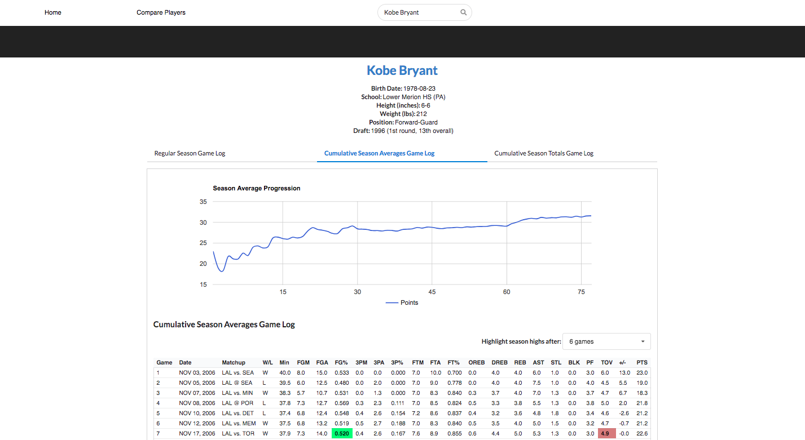

An NBA cumulative season average tracker that allows you to visualize the changes in a player's season averages as the season progresses.
Useful for determining their peak performance in the middle of a season.

**Note: there is a paucity of data for players prior to the 1973-74 season, so many game log stats could be missing**

### Running
**npm start** to run react app\
**npm run start:dev** to run node.js backend

Website runs on localhost:3000
Server runs on localhost:8080

**!IMPORTANT! The user-agent in the nba.js module(lib/api/stats/utils/fetch.js) must be changed to**\
**Mozilla/5.0 (Windows NT 6.1; Win64; x64) AppleWebKit/537.36 (KHTML, like Gecko) Chrome/61.0.3163.100 Safari/537.36**

### Npm packages
- npm install --save create-react-app
- npm install --save react-router-dom
- npm install --save redux
- npm install --save react-redux
- npm install --save eslint
- npm install --save axios
- npm install --save semantic-ui-React
- npm install --save express
- npm install --save body-parser
- npm install --save morgan
- npm install --save nba.js
- npm install --save fs
- npm install --save react-google-charts
    ##### **if cli is installed globally, need to install sequelize globally**
    - npm install -g sequelize-cli
    - npm install -g sequelize
    - npm install --save sequelize pg pg-hstore

### scripts
- npm run lint
- npm run start
- npm run start:dev
- npm run test
- npm run build
- npm run eject

### ESLINT
Using ESLint standard
