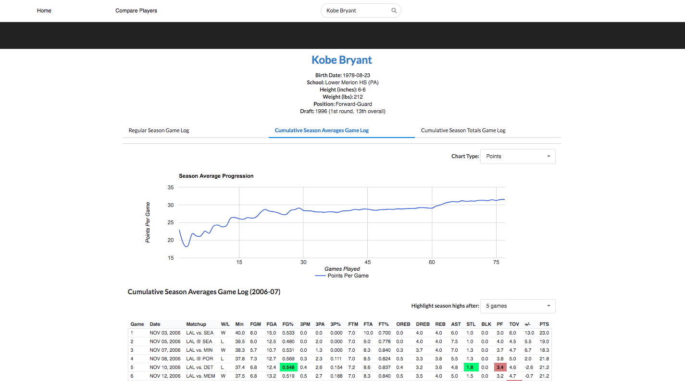

An NBA cumulative season average tracker that allows you to visualize the changes in a player's season averages as the season progresses.
Useful for determining their peak performance in the middle of a season.

**Note: there is a paucity of data for players prior to the 1973-74 season, so many game log stats could be missing**

### Running
`yarn start:web` to run react app\
`yarn start:server` to run node.js backend
`yarn start:offline` to run offline server (using nba player data from sample data) 

Website runs on localhost:3000\
Server runs on localhost:8080

### Installing npm packages
`yarn install`

### scripts
- `yarn lint`
- `yarn start:web`
- `yarn start:server`
- `yarn test`
- `yarn build-webpack`

### ESLINT
Using ESLint standard
